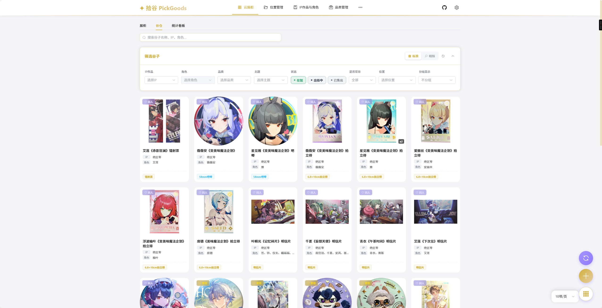
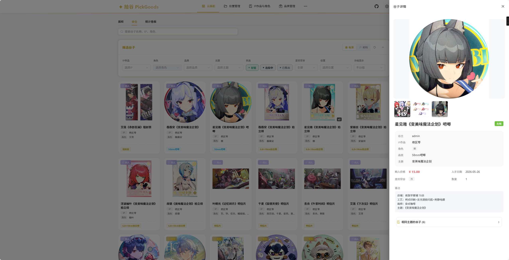
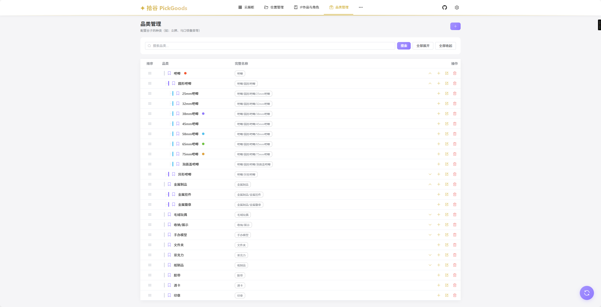
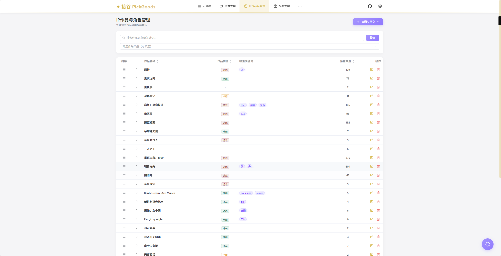
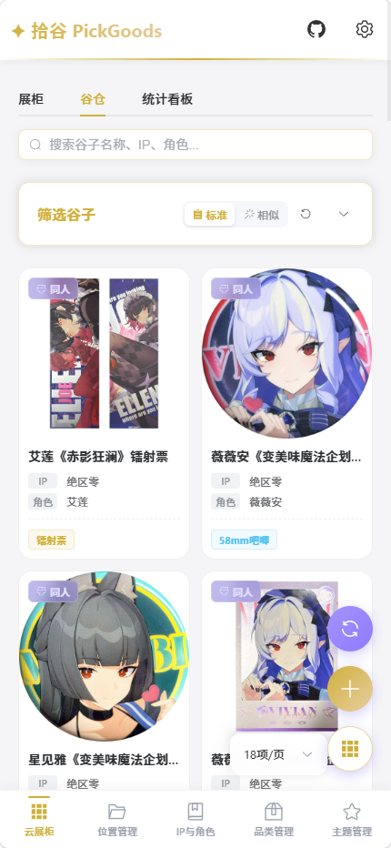
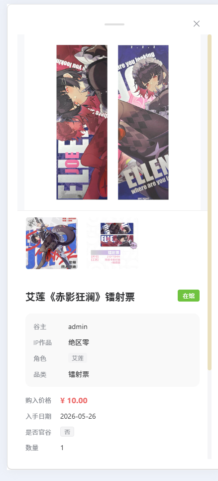

# 拾谷 · PickGoods

<div align="center">

> 面向「吃谷人」的个人谷子资产管理与检索系统

[](frontend/)
[](frontend/)
[](frontend/)
[](frontend/)
[](backend/)
[](backend/)
[](backend/)
[]()

</div>

---

## 项目简介

**拾谷（PickGoods）** 是一套面向二次元/游戏周边收藏者的数字化资产管理系统。系统围绕两个核心问题设计：

- **我有什么谷子？** —— 按 IP / 角色 / 品类等多维度快速检索、统一管理资产。
- **它们都放哪儿了？** —— 用树状的「物理收纳空间」模型精确标记每一件谷子的存放位置。


---

## 核心特性

### 前端

- **云展柜系统**：私有/公共展柜创建、编辑、封面上传、谷子排序与管理
- **谷仓检索**：多维过滤（IP、角色、品类、状态、位置）、全文搜索、分页、相似随机视图
- **统计看板**：资产概览、状态分布、官谷/同人分布、IP/品类 TopN（基于 ECharts）
- **资产录入**：新增/编辑谷子，多角色关联、主题标签、图片裁剪上传、主图与补充图片
- **草稿箱**：未完成的谷子存为草稿，随时继续编辑
- **位置管理**：树形收纳位置 CRUD、位置下谷子列表、级联查询
- **IP 与角色**：IP/角色管理、关键词别名、Bangumi 数据导入
- **品类/主题管理**：树形品类 CRUD、颜色标签、拖拽排序；主题聚合管理
- **管理后台**：用户管理、全站谷子管理、公共元数据管理
- **移动端支持**：基于 Capacitor 的 Android 原生壳支持

### 后端

- **JWT 认证**：无状态认证，多用户严格数据隔离
- **多维检索 API**：IP、角色（M2M）、品类、状态、位置等组合过滤，全文搜索
- **树状收纳空间**：无限层级（房间 → 柜子 → 层 → 抽屉），路径冗余自动维护
- **去重与确认**：新建谷子时检测重复返回 409 + 候选列表，支持合并策略
- **BGM API 集成**：从 Bangumi 搜索作品、获取角色并批量同步到本地
- **图片自动压缩**：上传时自动压缩至 300KB 以下，节省存储空间
- **自定义排序**：谷子和品类均支持拖拽排序，稀疏序列设计避免频繁重排
- **查询优化**：select_related / prefetch_related 解决 N+1，列表瘦身序列化器
- **限流保护**：检索接口 60 次/分钟限流
- **在线 API 文档**：drf-spectacular 自动生成 Swagger UI / Redoc

---

## 项目架构

```text
┌────────────────┐      REST API      ┌──────────────────────────────┐
│   Vue 3 前端    │ <────────────────> │    Django/DRF 后端             │
│  (Vite + Pinia) │   (JWT Auth)       │                              │
└────────────────┘                     └──────────────┬───────────────┘
                                                      │
                                       ┌──────────────┴───────────────┐
                                       │  核心业务模块                   │
                                       ├──────────────────────────────┤
                                       │   Users (认证/权限/数据隔离)    │
                                       │   Goods (资产+BGM集成)          │
                                       │   Location (物理收纳)           │
                                       └──────────────┬───────────────┘
                                                      │
                ┌─────────────────────────────────────┴────────────────┐
                ▼                                                      ▼
     ┌────────────────────┐                                 ┌────────────────────┐
     │   数据库 (SQLite/PG) │                                 │   媒体文件 (图片)    │
     └────────────────────┘                                 └────────────────────┘
```

### 数据流

1. **身份认证**：用户通过 `/api/auth/login/` 获取 JWT Token，后续请求携带 `Authorization: Bearer <token>`
2. **多用户隔离**：所有业务模型关联 `user` 字段，后端通过 `IsOwnerOnly` 权限类和 QuerySet 过滤实现物理隔离
3. **公共元数据**：IP、角色、品类为公共数据，所有人可读，仅管理员可增删改
4. **前端请求**：Axios 封装 + Vite 开发代理（`/api` → `http://127.0.0.1:8000`），支持运行时配置后端地址

---

## 项目结构

```
PickGoods/
├── frontend/               # Vue 3 + TypeScript + Vite 前端
│   ├── src/
│   │   ├── api/            # 后端接口封装与类型定义
│   │   ├── components/     # 通用组件、展柜组件、统计组件
│   │   ├── router/         # Vue Router 路由与鉴权守卫
│   │   ├── stores/         # Pinia 状态管理
│   │   ├── styles/         # 主题变量、全局样式
│   │   ├── utils/          # request 封装、树工具
│   │   └── views/          # 页面级组件
│   │       ├── admin/      # 管理后台页面
│   │       └── goods-form/ # 谷子表单拆分模块
│   ├── docs/               # 前端文档
│   ├── capacitor.config.ts # Capacitor 移动端配置
│   ├── package.json
│   └── README.md
│
├── backend/                 # Django 5.2 + DRF 后端
│   ├── ShiGu/               # Django 项目配置
│   ├── apps/
│   │   ├── users/           # 用户、角色与认证
│   │   ├── goods/           # 谷子核心域（IP/角色/品类/主题/展柜/BGM）
│   │   ├── location/        # 物理收纳节点
│   │   └── admin_api/       # 后台管理 REST API
│   ├── core/                # JWT、认证、权限共享框架
│   ├── media/               # 上传媒体文件目录
│   ├── manage.py
│   ├── manage.sh            # 生产环境服务管理脚本
│   ├── gunicorn_config.py   # Gunicorn 配置
│   ├── requirements.txt
│   ├── api.md               # API 完整文档
│   └── README.md
│
└── README.md                # 本文件
```

---

## 功能模块概览

| 模块     | 路由                             | 说明                           |
| ------ | ------------------------------ | ---------------------------- |
| 登录/注册  | `/login`                       | 注册、登录获取 Token，受保护路由自动跳转登录页   |
| 云展柜    | `/showcase`                    | 默认入口，包含「展柜」「谷仓」「统计看板」三个 Tab  |
| 展柜     | `/showcase`                    | 私有/公共展柜切换，创建、编辑、删除、封面上传、谷子管理 |
| 谷仓     | `/showcase`                    | 搜索、筛选、分页、相似随机视图、详情抽屉、右键操作    |
| 统计看板   | `/showcase`                    | 资产概览、状态分布、官谷/同人分布、IP/品类 TopN |
| 资产录入   | `/goods/new` `/goods/:id/edit` | 新增/编辑谷子，多角色、主题、图片裁剪上传        |
| 草稿箱    | `/goods/drafts`                | 查看并继续编辑状态为 `draft` 的谷子       |
| 位置管理   | `/location`                    | 树形收纳位置 CRUD、位置下谷子列表          |
| IP 与角色 | `/ipcharacter`                 | IP/角色管理、关键词、Bangumi 导入       |
| 品类管理   | `/category`                    | 树形品类 CRUD、颜色标签、拖拽排序          |
| 主题管理   | `/theme`                       | 主题 CRUD、主题图片管理               |
| 设置     | `/settings`                    | 后端地址配置、账号信息、退出登录、管理员入口       |
| 管理后台   | `/admin/*`                     | 管理员：用户管理、全站谷子管理、公共元数据管理      |

---

## 界面截图

<div align="center">

### PC 端



*PC 端云展柜/谷仓界面*



*PC 端谷子详情界面*



*PC 端品类管理界面*



*PC 端 IP 与角色管理界面*

### 移动端

<table>
<tr>
<td align="center"><br/><em>云展柜/谷仓</em></td>
<td align="center"><br/><em>谷子详情</em></td>
</tr>
</table>

</div>

---

## 技术栈

| 层级       | 技术                         | 说明                 |
| -------- | -------------------------- | ------------------ |
| 前端框架     | Vue 3.5 + Composition API  | SPA 应用             |
| 类型系统     | TypeScript 5.9             | 全量类型覆盖             |
| 构建工具     | Vite 7.3                   | 开发服务器与生产构建         |
| UI 组件库   | Element Plus 2.8           | 统一 UI 风格           |
| 状态管理     | Pinia 3.0                  | 响应式状态管理            |
| 路由       | Vue Router 4.6             | 导航鉴权守卫             |
| HTTP 客户端 | Axios 1.7                  | API 请求封装           |
| 图表       | ECharts 6.0                | 统计看板可视化            |
| 拖拽排序     | SortableJS + 稀疏排序          | 谷子/品类排序            |
| 图片裁剪     | vue-picture-cropper        | 主图/封面裁剪            |
| 移动端      | Capacitor 8.0              | Android 原生壳        |
| 后端框架     | Django 5.2 + DRF 3.14      | RESTful API        |
| 认证       | JWT (HS256)                | 无状态认证              |
| 数据库      | SQLite（开发）/ PostgreSQL（生产） | 多用户隔离              |
| API 文档   | drf-spectacular            | Swagger UI / Redoc |
| 图片处理     | Pillow 10.0+               | 自动压缩               |
| WSGI 服务器 | Gunicorn                   | 生产环境部署             |

---

## 快速开始

### 环境要求

| 工具      | 要求                           |
| ------- | ---------------------------- |
| Node.js | `^20.19.0 \|\| >=22.12.0`    |
| pnpm    | `>=9.0.0`                    |
| Python  | 3.11+                        |
| 数据库     | SQLite（开发默认）/ PostgreSQL（生产） |

### 后端

```bash
cd backend

# 创建并激活虚拟环境
python -m venv venv
venv\Scripts\activate      # Windows
# source venv/bin/activate  # Linux/macOS

# 安装依赖并初始化数据库
pip install -r requirements.txt
python manage.py migrate

# 可选：创建管理员
python manage.py createsuperuser

# 启动开发服务器
python manage.py runserver
```

后端运行在 `http://127.0.0.1:8000`，API 根路径为 `/api/`，在线 API 文档位于 `/api/schema/swagger-ui/`。

### 前端

```bash
cd frontend

pnpm install

# 可选：设置后端地址（新建 .env 文件）
# VITE_API_BASE_URL=http://127.0.0.1:8000

pnpm dev
```

前端运行在 `http://localhost:5173`，Vite 已配置开发代理将 `/api` 转发到 `http://127.0.0.1:8000`。

### 后端地址优先级

前端每次请求会按以下优先级确定后端地址：

1. 设置页写入的 `localStorage.pickgoods_api_base_url`
2. 兼容旧键 `localStorage.shigu_api_base_url`
3. 构建时环境变量 `VITE_API_BASE_URL`
4. 默认值 `当前页面协议://当前页面主机名:8000`

---

## API 概览

| 模块     | 端点                  | 说明                    |
| ------ | ------------------- | --------------------- |
| 认证中心   | `/api/auth/`        | 注册、登录、个人信息、退出         |
| IP 管理  | `/api/ips/`         | IP 作品 CRUD，支持关键词和作品类型 |
| 角色管理   | `/api/characters/`  | 角色 CRUD，按 IP 过滤       |
| 品类管理   | `/api/categories/`  | 树形品类 CRUD，批量排序        |
| 谷子管理   | `/api/goods/`       | 检索与 CRUD，主图/补充图上传，排序  |
| 统计     | `/api/goods/stats/` | 仪表盘统计数据               |
| 主题管理   | `/api/themes/`      | 主题 CRUD，主题图片上传        |
| 展柜管理   | `/api/showcases/`   | 公有/私有展柜，谷子关联管理        |
| 位置管理   | `/api/location/`    | 收纳节点 CRUD，位置树下发       |
| BGM 集成 | `/api/bgm/`         | 搜索作品、获取角色、批量同步        |

完整的 API 文档见 [backend/api.md](backend/api.md)，或启动后端后访问 Swagger UI。

---

## 开发命令

### 前端

```bash
pnpm dev           # 启动开发服务器
pnpm build         # 类型检查 + 生产构建
pnpm preview       # 本地预览生产构建
pnpm type-check    # vue-tsc 类型检查
pnpm lint          # ESLint 检查并修复
pnpm test:unit     # Vitest 单元测试
```

### 后端

```bash
python manage.py test                  # 运行测试
python manage.py rebalance_goods_order  # 重排谷子排序值
```

---

## 部署

### 后端

使用 Gunicorn + Nginx 部署，项目提供了 `manage.sh` 脚本和 `gunicorn_config.py` 配置：

```bash
./manage.sh start     # 启动
./manage.sh stop      # 停止
./manage.sh restart   # 重启
./manage.sh status    # 查看状态
```

详细部署说明见 [后端 README](backend/README.md#-部署指南)。

### 前端

```bash
pnpm build    # 生成 dist/ 目录
pnpm deploy   # 通过 SFTP 上传到服务器（需配置 deploy.cjs）
```

前端为纯静态资源，可使用 Nginx 托管，详见 [前端部署文档](frontend/docs/DEPLOYMENT.md)。

---

## 文档索引

| 文档                                             | 说明                       |
| ---------------------------------------------- | ------------------------ |
| [前端 README](frontend/README.md)                | 前端技术栈、功能概览、开发命令          |
| [后端 README](backend/README.md)                 | 后端核心特性、代码结构、部署指南         |
| [后端 API 文档](backend/api.md)                    | 完整 API 接口说明与请求/响应示例      |
| [前端功能特性](frontend/docs/FEATURES.md)            | 页面、模块和主要交互说明             |
| [前端开发指南](frontend/docs/DEVELOPMENT.md)         | 本地开发、约定、测试               |
| [前端部署说明](frontend/docs/DEPLOYMENT.md)          | Web 部署、Nginx、SFTP 脚本     |
| [前端移动端开发](frontend/docs/MOBILE_DEVELOPMENT.md) | Capacitor Android/iOS 接入 |
| [前端设计规范](frontend/docs/STYLING.md)             | 主题变量、样式结构                |
| [前端常见问题](frontend/docs/TROUBLESHOOTING.md)     | 开发、部署排障                  |

---

## 许可证

MIT

---

<div align="center">

**拾谷 · PickGoods** —— 让每一件谷子都有归属

</div>
