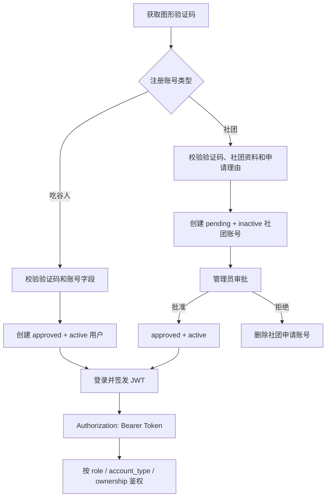
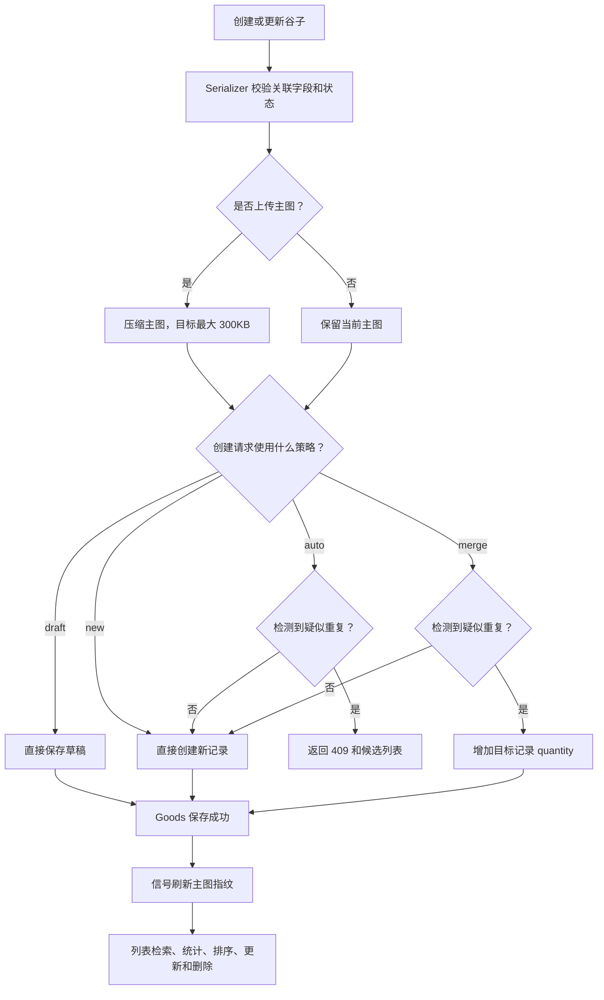
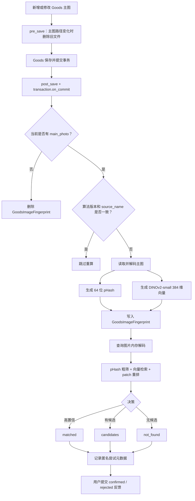
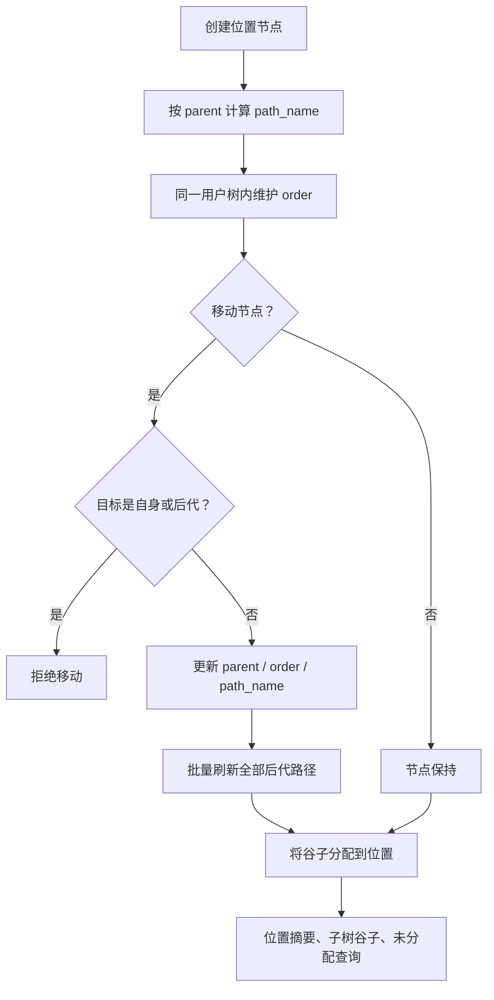
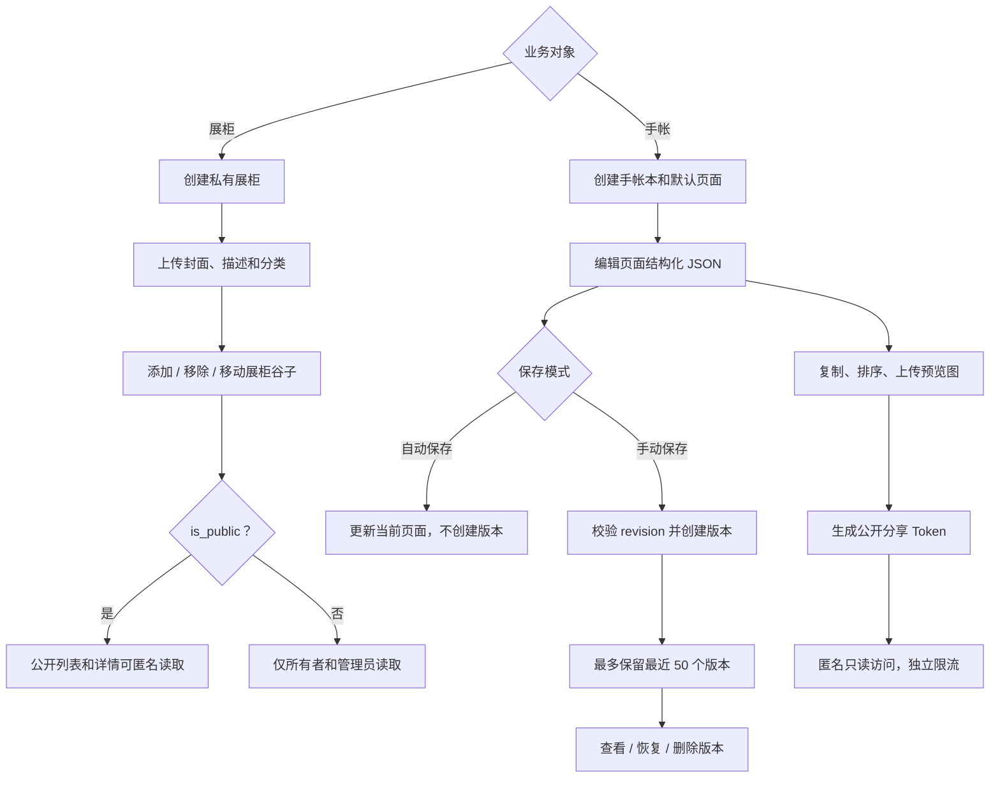
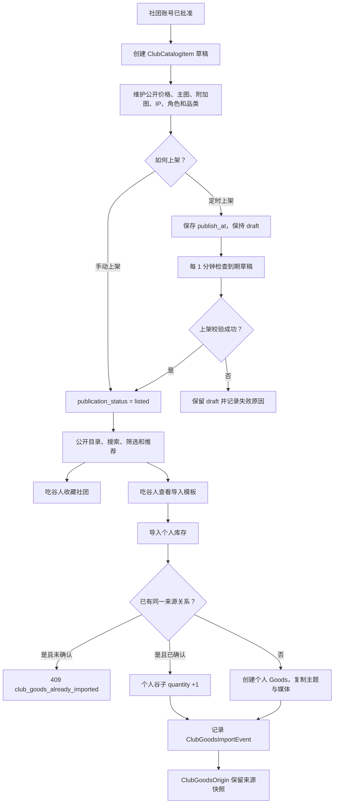
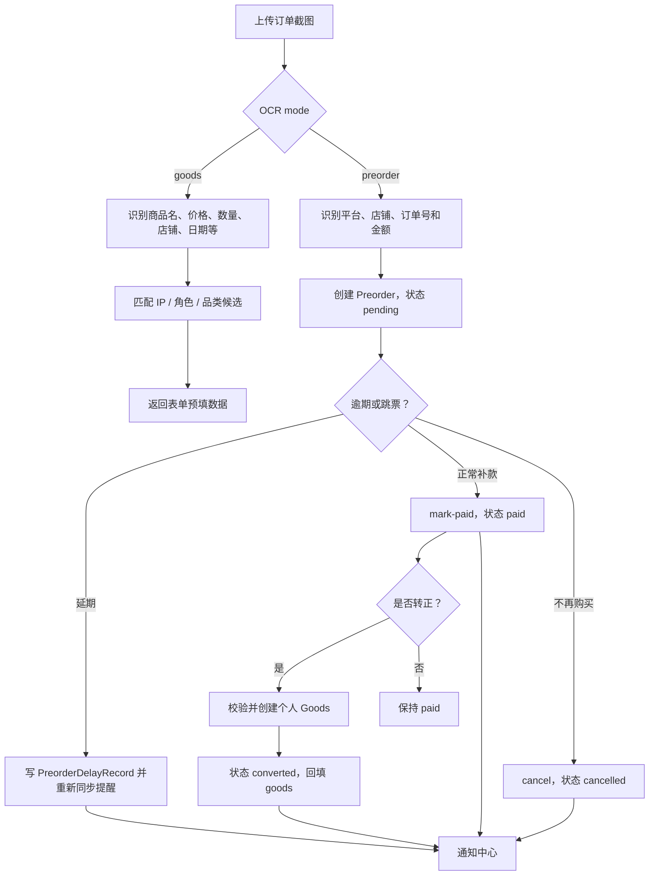
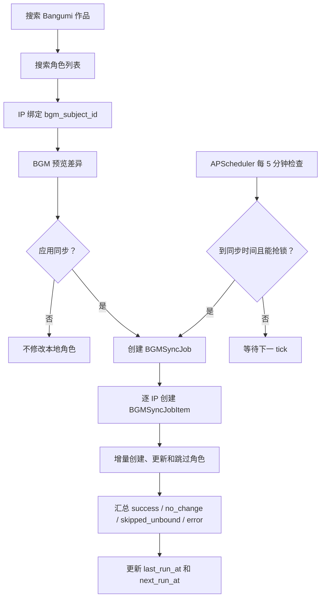
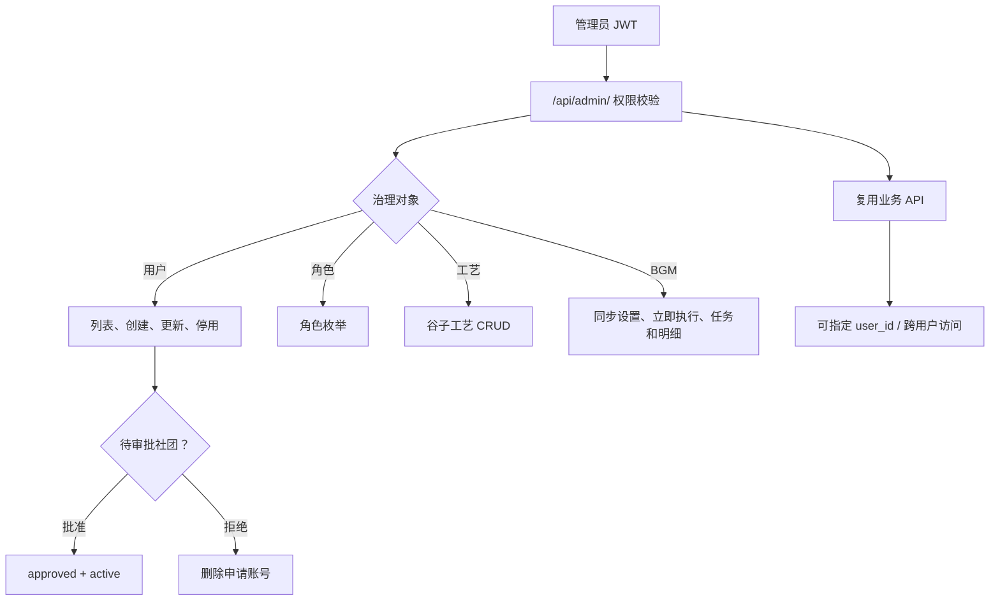
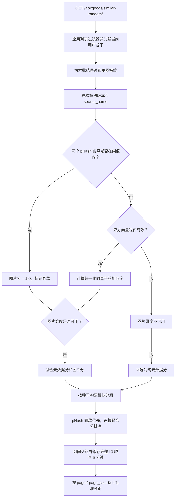

# 拾谷 PickGoods 后端

拾谷后端是基于 Django 6 + Django REST Framework + SQLite 构建的收藏资产 API。除谷子资产、位置、展柜和手帐外，当前代码还包含社团账号与公开目录、BGM 自动同步、OCR、预购尾款提醒、主图视觉匹配和管理员治理能力。

> 本文是后端总入口，重点说明系统结构、权限边界和核心业务流程。字段级请求/响应说明以 [`api.md`](api.md) 和 [`admin_api.md`](admin_api.md) 为准。

## 快速导航

| 文档 | 内容 |
| --- | --- |
| [本地启动](#本地启动) | 环境、数据库、模型和开发服务 |
| [权限模型](#权限模型) | 公共、登录用户、吃谷人、社团、管理员 |
| [核心业务流程](#核心业务流程) | `FLOW-01` 至 `FLOW-10` 端到端流程 |
| [API 概览](#api-概览) | 按权限分组的接口入口 |
| [数据模型](#数据模型) | 各业务域模型清单 |
| [管理命令](#管理命令) | 初始化、测试数据、模型下载和索引维护 |
| [后台任务](#后台任务) | BGM 同步、社团定时上架、验证码清理 |
| [生产部署](#生产部署) | Gunicorn、Nginx、迁移和静态文件 |
| [生产配置风险](#生产配置风险) | 上线前必须处理的当前限制 |

## 核心能力

### 用户、社团与权限

- 自实现 HS256 JWT，不依赖 Simple JWT；Token 默认有效期 7 天。
- 账号分为 `collector`（吃谷人）和 `club`（社团）两类业务身份。
- 注册支持一次性图形验证码；社团账号注册后进入 `pending`，需管理员批准。
- 公共元数据主要按“登录可读、管理员可写”管理；用户资产按所有权隔离。
- 社团公开资料、收藏、目录条目和个人库存导入拥有独立权限及限流。

### 谷子资产

- 关联 IP、多个角色、树形品类、主题、工艺和存储位置。
- 记录数量、单价、状态、官谷/同人、入手日期、备注、主图和附加图片。
- 上传图片自动压缩；主图在事务提交后建立 pHash 与 DINOv2 向量指纹。
- 支持组合筛选、搜索、分页、统计、元数据与主图融合的相似随机展示，以及图片形状分类。
- 创建时按关键字段检测疑似重复，通过 `auto`、`new`、`merge` 策略处理。
- 使用稀疏排序值与移动接口维护用户自己的谷子顺序。

### 位置、展柜与手帐

- `StorageNode` 自关联形成任意层级位置树，自动维护完整路径。
- 支持位置摘要、子树谷子、节点移动、批量归位和未分配谷子查询。
- 展柜支持公开/私有可见性、封面、分类和谷子排序。
- 手帐支持多本、多页、结构化画布 JSON、自动保存、版本历史、恢复、复制和公开分享。

### 社团目录

- 社团目录 `ClubCatalogItem` 与个人库存 `Goods` 完全解耦。
- 目录条目支持草稿、上架、下架和一次性定时上架。
- 公开目录支持搜索、筛选、推荐排序、收藏和详情浏览。
- 吃谷人可从目录导入个人库存，并通过 `ClubGoodsOrigin` 保留来源与导入历史。

### Bangumi、OCR 与图片识别

- 搜索 Bangumi 作品和角色，支持 IP 绑定、差异预览和增量同步。
- APScheduler 在进程内执行 BGM 自动同步、社团定时上架和验证码清理。
- PaddleOCR 3 识别订单截图，支持 `goods` 与 `preorder` 两种解析模式。
- jieba、RapidFuzz 用于从 OCR 文本匹配 IP、角色、品类和订单字段。
- 主图视觉匹配使用 DINOv2-small 量化 ONNX、pHash 和局部特征重排；查询图片不落盘。

### 预购与通知

- 记录定金、尾款、平台、店铺、订单号、预计补款时间与时间粒度。
- 预购状态按 `pending -> paid -> converted` 或 `pending -> cancelled` 流转。
- 支持厂家跳票延期、延期历史、补款、转正为个人谷子和通知中心。
- `soon`、`due` 提醒采用惰性幂等同步，不依赖额外定时器。

## 技术栈

| 分类 | 技术 |
| --- | --- |
| Web | Django 6、Django REST Framework |
| 查询 | django-filter、DRF SearchFilter |
| 认证 | 自实现 JWT HS256、Bearer Token |
| 验证码 | django-simple-captcha |
| 数据库 | SQLite；**当前代码未实现 PostgreSQL 切换** |
| API 文档 | drf-spectacular、Swagger UI、Redoc |
| 图片处理 | Pillow、OpenCV、NumPy |
| 图片匹配 | ONNX Runtime、DINOv2-small 量化模型、pHash |
| OCR | PaddlePaddle 3、PaddleOCR 3 |
| 文本匹配 | jieba、RapidFuzz |
| 调度 | APScheduler 3 |
| 部署 | Gunicorn、Nginx |

## 系统架构

```text
Vue / Capacitor / API 客户端
            |
            v
     Nginx / 反向代理
            |
            v
Gunicorn -> Django + DRF
            |-- SQLite
            |-- media/ 本地文件
            |-- PaddleOCR / DINOv2 ONNX
            |-- APScheduler 进程内后台线程
            |-- Bangumi HTTP API
```

后端按业务域拆分在 `apps/` 下；认证和权限基础设施位于 `core/`；Django 配置、根路由和 WSGI/ASGI 入口位于 `ShiGu/`。

## 项目结构

```text
backend/
├─ ShiGu/
│  ├─ settings.py              # Django、DRF、JWT、CORS、媒体文件、模型与调度配置
│  ├─ urls.py                  # 根路由、DRF Router、公开接口和 Schema
│  ├─ asgi.py
│  └─ wsgi.py
├─ core/
│  ├─ authentication.py        # DRF JWTAuthentication
│  ├─ jwt.py                   # HS256 Token 编码、解码与过期校验
│  └─ permissions.py           # 所有权、账号类型、管理员权限
├─ apps/
│  ├─ users/                   # 用户、社团、认证、社团目录、收藏、推荐
│  ├─ goods/
│  │  ├─ models/               # 元数据、谷子、主题、展柜、手帐、BGM、图片匹配
│  │  ├─ serializers/          # 按业务域拆分的序列化器
│  │  ├─ views/                # ViewSet、Action 和接口
│  │  ├─ image_match/          # 指纹、推理、匹配与索引
│  │  ├─ management/commands/  # 种子数据、模型下载和索引维护
│  │  ├─ bgm_*.py              # BGM 服务、同步和后台任务
│  │  ├─ club_scheduler.py     # 社团目录定时上架
│  │  ├─ scheduler.py          # APScheduler 注册入口
│  │  └─ similarity.py         # 元数据与主图融合相似度
│  ├─ location/                # 位置树、路径维护和归位接口
│  ├─ reminder/                # 预购、延期记录和通知
│  ├─ ocr/                     # PaddleOCR、订单解析和预购解析
│  └─ admin_api/               # 管理员专用 REST API
├─ media/                      # 开发环境上传文件，生产需单独托管/备份
├─ models/goods_match/         # DINOv2-small 量化 ONNX 模型
├─ .env.example                # 环境变量模板
├─ api.md                      # 业务 API 详细文档
├─ admin_api.md                # 管理员 API 详细文档
├─ gunicorn_config.py
├─ manage.sh
├─ manage.py
├─ pyproject.toml
└─ requirements.txt
```

## 本地启动

### 1. 环境要求

`pyproject.toml` 声明 Python `>=3.13`。PaddlePaddle 3.0 对平台/Python 版本有额外要求，建议先确认目标环境可安装依赖。

当前有两套依赖描述：

- `pyproject.toml`：包含 `django-extensions`、`drf-spectacular`，但没有列出 `django-simple-captcha`。
- `requirements.txt`：包含 `django-simple-captcha`，但没有列出 `django-extensions` 和 `drf-spectacular`。

因此使用 `requirements.txt` 初始化环境时，还需要补齐项目实际启用的扩展：

```powershell
pip install -r requirements.txt
pip install django-extensions drf-spectacular
```

### 2. 创建环境

```powershell
cd backend
python -m venv .venv
.\.venv\Scripts\Activate.ps1
pip install -r requirements.txt
pip install django-extensions drf-spectacular
```

### 3. 配置环境变量

```powershell
Copy-Item .env.example .env
```

至少设置：

```env
DJANGO_SECRET_KEY=请替换为随机密钥
```

生成 Django 密钥：

```powershell
python -c "from django.core.management.utils import get_random_secret_key; print(get_random_secret_key())"
```

完整变量见 [环境变量](#环境变量)。

### 4. 初始化数据库

```powershell
python manage.py migrate
python manage.py seed_users --admin-username admin --admin-password "请替换为强密码"
```

### 5. 准备可选模型

使用 OCR 前：

```powershell
python manage.py download_ocr_models
```

使用拍图找谷子前：

```powershell
python manage.py download_goods_match_model
python manage.py rebuild_goods_image_index
```

### 6. 启动开发服务

```powershell
python manage.py runserver
```

默认地址：

- API：`http://127.0.0.1:8000/api/`
- Django Admin：`http://127.0.0.1:8000/admin/`
- Swagger UI：`http://127.0.0.1:8000/api/schema/swagger-ui/`
- Redoc：`http://127.0.0.1:8000/api/schema/redoc/`

## 权限模型

### 身份维度

| 字段 | 可选值 | 作用 |
| --- | --- | --- |
| `role` | `Admin`、`User` 等 | 系统角色，`Admin` 拥有管理员权限 |
| `account_type` | `collector`、`club` | 区分吃谷人与社团业务身份 |
| `approval_status` | `pending`、`approved` | 社团账号审批状态 |
| `is_active` | `true`、`false` | 是否允许登录和访问 |

### 访问边界

| 访问级别 | 典型能力 |
| --- | --- |
| 匿名 | 注册、登录、验证码、公开展柜、公开手帐、公开社团目录 |
| 已登录 | 当前用户资料、头像、业务 API 的通用入口 |
| 吃谷人 | 个人谷子、位置、展柜、手帐、预购、通知、OCR、图片匹配 |
| 社团 | 社团资料、目录条目、定时上架、目录图片和上下架管理 |
| 管理员 | `/api/admin/`、用户审批、角色、工艺、BGM 同步及跨用户管理 |

管理员仍可通过 `IsOwnerOnly` 等权限实现跨用户访问；普通用户的谷子、位置、主题、展柜、手帐和预购默认按 `user` 隔离。

### 主要限流

| Scope | 默认速率 | 用途 |
| --- | ---: | --- |
| `auth_register` | 10/hour | 注册 |
| `auth_login` | 10/minute | 登录 IP |
| `auth_login_username` | 10/minute | 登录用户名 |
| `auth_captcha` | 30/minute | 获取验证码 |
| `auth_captcha_image` | 60/minute | 验证码图片 |
| `goods_search` | 60/minute | 谷子查询 |
| `goods_image_match` | 20/minute | 拍图找谷子 |
| `goods_match_feedback` | 60/minute | 匹配反馈 |
| `ocr` | 20/minute | OCR |
| `journal_public` | 60/minute | 公开手帐 |
| `club_public_read` | 60/minute | 公开社团目录 |
| `club_write` | 60/minute | 社团公开写操作 |
| `club_manage` | 120/minute | 社团目录管理 |
| `club_import` | 10/minute | 从社团导入个人库存 |

当前限流使用进程内 `LocMemCache`；多 Worker 环境下每个进程独立计数。

## 核心业务流程

### 业务流程索引

| 标识 | 流程 | 主要角色 | 主要入口 | 详细文档 |
| --- | --- | --- | --- | --- |
| [FLOW-01](#flow-01) | 账号注册、登录与社团审批 | 匿名、社团、管理员 | `/api/auth/`、`/api/admin/users/` | [api.md](api.md) |
| [FLOW-02](#flow-02) | 谷子资产生命周期 | 吃谷人、管理员 | `/api/goods/` | [api.md](api.md) |
| [FLOW-03](#flow-03) | 主图指纹与拍图找谷子 | 吃谷人 | `/api/goods/` | [api.md](api.md) |
| [FLOW-04](#flow-04) | 位置树与归位 | 吃谷人 | `/api/location/` | [api.md](api.md) |
| [FLOW-05](#flow-05) | 展柜与手帐 | 吃谷人、匿名 | `/api/showcases/`、`/api/journals/` | [api.md](api.md) |
| [FLOW-06](#flow-06) | 社团目录与导入 | 社团、吃谷人、匿名 | `/api/clubs/` | [api.md](api.md) |
| [FLOW-07](#flow-07) | OCR、预购与通知 | 吃谷人 | `/api/ocr/`、`/api/preorders/` | [api.md](api.md) |
| [FLOW-08](#flow-08) | BGM 同步与后台任务 | 管理员、系统 | `/api/ips/`、`/api/bgm/`、`/api/admin/` | [api.md](api.md) |
| [FLOW-09](#flow-09) | 管理员治理 | 管理员 | `/api/admin/` | [admin_api.md](admin_api.md) |
| [FLOW-10](#flow-10) | 相似谷子排序与调优 | 吃谷人、运维 | `/api/goods/similar-random/` | [api.md](api.md) |

<a id="flow-01"></a>
### FLOW-01 账号注册、登录与社团审批



关键规则：

- `REGISTER_CAPTCHA_ENABLED` 默认开启；验证码单次使用、大小写不敏感、过期后不可用。
- 吃谷人注册成功立即返回 Token；社团注册返回 `202 account_pending`，不返回 Token。
- 待审批、停用账号均不能登录；审批与启用是两个独立门槛。
- 管理员批准会写入 `approved + active`；拒绝会删除该待审批社团账号。
- JWT 为无状态 Token，登出仅返回成功，需由客户端删除本地 Token。

代码入口：

- `apps/users/views.py`
- `apps/users/serializers.py`
- `apps/users/throttling.py`
- `core/jwt.py`
- `core/authentication.py`

主要接口：

| 方法 | 路径 | 说明 |
| --- | --- | --- |
| GET | `/api/auth/captcha/` | 获取验证码 key 和图片地址 |
| GET | `/api/auth/captcha/{key}/image/` | 获取验证码图片 |
| POST | `/api/auth/register/` | 注册吃谷人或提交社团申请 |
| POST | `/api/auth/login/` | 登录获取 JWT |
| GET/PATCH | `/api/auth/me/` | 获取或修改当前账号 |
| POST/DELETE | `/api/auth/me/avatar/` | 上传或删除个人头像 |
| DELETE | `/api/auth/logout/` | 无状态登出 |

<a id="flow-02"></a>
### FLOW-02 谷子资产生命周期



关键规则：

- 重复候选按“用户 + IP + 名称 + 角色集合 + 入手日期 + 单价”识别。
- `auto` 检测到候选返回 `409 goods_duplicate`；前端需选择 `new` 或 `merge`。
- `merge` 只增加已有谷子数量，不覆盖主图和其他内容；多候选时必须传 `merge_target_id`。
- 社团账号不能通过个人谷子接口创建资产，应使用社团目录接口。
- 状态包括 `draft`、`intended`、`in_cabinet`、`outdoor`、`sold`。
- `draft` 放宽角色必填；正式状态要求 IP、品类和至少一个角色。
- 主图与附加图片上传后自动压缩；删除谷子会级联删除补充图片和指纹，并删除主图文件。
- `order` 使用稀疏排序值，移动或历史数据冲突时可用 `rebalance_goods_order` 重排。

主要 Action：

| 路径 | 说明 |
| --- | --- |
| `/api/goods/` | 列表、创建、详情、更新和删除 |
| `/api/goods/{id}/upload-main-photo/` | 单独上传/替换主图 |
| `/api/goods/{id}/upload-additional-photos/` | 新增或更新附加图片 |
| `/api/goods/{id}/move/` | 调整稀疏排序位置 |
| `/api/goods/stats/` | Dashboard 统计 |
| `/api/goods/similar-random/` | 元数据与主图融合的相似随机展示 |
| `/api/goods/classify-image/` | 图片形状分类与品类建议 |

<a id="flow-03"></a>
### FLOW-03 主图指纹与拍图找谷子



指纹生命周期：

- `GoodsImageFingerprint` 与 `Goods` 一对一，只维护主图，不为附加图建立指纹。
- 保存任意 `Goods` 字段都会触发检查，但只有算法版本或 `source_name` 变化、指纹缺失时才重算。
- 清空主图会删除指纹；同一个路径下直接覆盖图片内容不会自动识别，必须使用 `--force` 重建。
- 匹配只使用当前用户、状态为 `in_cabinet/outdoor`、算法版本一致且源路径匹配的指纹。
- 模型不可用时返回 `503 goods_image_match_unavailable`；图片无效返回 `422 invalid_image`。
- 查询图片只在内存中处理，不落盘；识别结果只保存分数和反馈元数据。
- 谷仓“相似”排序会融合元数据分和主图分，完整规则见 [FLOW-10](#flow-10)。

代码入口：

- `apps/goods/signals.py`
- `apps/goods/image_match/indexing.py`
- `apps/goods/image_match/features.py`
- `apps/goods/image_match/service.py`
- `apps/goods/similarity.py`

主要接口：

| 方法 | 路径 | 说明 |
| --- | --- | --- |
| POST | `/api/goods/match-image/` | 上传照片匹配当前用户谷仓 |
| POST | `/api/goods/match-feedback/` | 提交匹配反馈 |
| GET | `/api/goods/similar-random/` | 相似随机展示 |
| POST | `/api/goods/classify-image/` | 图片形状分类 |

<a id="flow-04"></a>
### FLOW-04 位置树与归位



关键规则：

- 位置树按用户隔离；管理员可跨用户访问。
- 移动节点不能形成环，不能移动到自身或自己的后代。
- 节点重命名或移动后会刷新全部后代 `path_name`。
- 删除节点会删除其子树，并把相关谷子的位置置空，不删除谷子。
- 位置摘要接口返回直接数量、后代数量、容量使用率、状态分布和近期谷子。
- 批量归位在事务中校验全部谷子归属，避免部分更新。

主要接口：

| 方法 | 路径 | 说明 |
| --- | --- | --- |
| GET/POST | `/api/location/nodes/` | 位置列表与创建 |
| GET/PATCH/DELETE | `/api/location/nodes/{id}/` | 位置详情、更新和删除 |
| GET | `/api/location/nodes/{id}/goods/` | 节点子树谷子 |
| GET | `/api/location/nodes/{id}/summary/` | 节点摘要 |
| POST | `/api/location/nodes/{id}/move/` | 移动位置节点 |
| GET | `/api/location/tree/` | 一次性下发位置树 |
| POST | `/api/location/move-goods/` | 批量归位谷子 |
| GET | `/api/location/unassigned-goods/` | 未分配谷子 |

<a id="flow-05"></a>
### FLOW-05 展柜与手帐



展柜规则：

- 展柜与谷子通过 `ShowcaseGoods` 中间表排序。
- `add-goods` 只允许添加当前用户自己的谷子。
- 公开展柜可匿名读，私有展柜按 `is_public` 和所有权限制。

手帐规则：

- 新建手帐会自动创建默认页面；页面拒绝跨用户访问。
- 自动保存只更新页面；手动保存在同一事务内创建历史版本并检查 `revision`。
- Revision 冲突返回 `409`，避免覆盖其他设备的编辑。
- 恢复历史版本会更新当前页，同时生成新的版本记录。
- 页面内容包含多层版本和绘制点数量限制；公开页只读且使用 `journal_public` 限流。

主要接口：

| 路径 | 说明 |
| --- | --- |
| `/api/showcases/` | 展柜 CRUD |
| `/api/showcases/public/` | 匿名公开展柜列表 |
| `/api/showcases/private/` | 当前用户私有展柜 |
| `/api/showcases/{id}/add-goods/` | 添加谷子 |
| `/api/showcases/{id}/remove-goods/` | 移除谷子 |
| `/api/showcases/{id}/move-goods/` | 展柜内排序 |
| `/api/journals/` | 手帐本 CRUD |
| `/api/journals/{id}/pages/` | 页面列表与创建 |
| `/api/journals/{id}/pages/reorder/` | 页面排序 |
| `/api/journal-pages/{id}/versions/` | 页面版本 |
| `/api/journal-pages/{id}/share/` | 生成公开分享 Token |
| `/api/journal-public/{token}/` | 匿名公开手帐 |

<a id="flow-06"></a>
### FLOW-06 社团目录与导入



关键规则：

- 社团目录和个人库存使用不同表，社团不能访问吃谷人的个人工作区。
- `publication_status`：`draft`（草稿）、`listed`（上架）、`unlisted`（下架）。
- 定时上架是一次性任务：成功切换为 `listed`；失败保留草稿并写入 `publish_failed_at/publish_error`，不会自动重试。
- 手动上架、下架或取消计划会清除旧失败信息和 `publish_at`。
- 公开目录支持 IP、角色、品类子树、主题、价格、导入状态、搜索、排序和分页。
- 推荐排序会结合公开目录特征、当前用户个人收藏信号和社团热度；匿名用户使用非个性化排序。
- 导入复制主图/附加图和所需主题，但个人谷子始终 `is_official=false`。
- 来源条目或个人谷子后来被删除时，来源关系保留历史快照；重新导入可复用来源关系。
- 批量删除、批量下架和重排均在事务中校验所有权，拒绝部分成功。

主要接口：

| 路径 | 说明 |
| --- | --- |
| `/api/clubs/` | 公开社团列表与推荐 |
| `/api/clubs/{id}/` | 公开社团详情 |
| `/api/clubs/{id}/goods/` | 公开目录谷子 |
| `/api/clubs/{id}/goods/facets/` | 公开目录筛选聚合 |
| `/api/clubs/{id}/favorite/` | 收藏/取消收藏 |
| `/api/clubs/me/` | 当前社团资料 |
| `/api/clubs/me/goods/` | 当前社团目录管理 |
| `/api/clubs/me/goods/reorder/` | 目录排序 |
| `/api/clubs/{id}/goods/{goods_id}/import-template/` | 导入模板 |
| `/api/clubs/goods/{goods_id}/import/` | 导入个人库存 |

<a id="flow-07"></a>
### FLOW-07 OCR、预购与通知



OCR 规则：

- `goods` 模式返回商品、IP、角色、品类、价格、数量、日期和官谷/同人候选。
- `preorder` 模式返回平台、店铺、订单号、商品、定金、尾款和预计补款时间。
- 高手机截图会裁剪状态栏/底部区域，并把最长边缩放到 1280px；全程内存处理。
- OCR 首次使用会加载 PaddleOCR，建议通过管理命令预下载模型。

预购状态机：

| 当前状态 | 动作 | 下一状态 | 约束 |
| --- | --- | --- | --- |
| `pending` | `mark-paid` | `paid` | 记录 `paid_at`，将提醒标记已读 |
| `pending` | `cancel` | `cancelled` | 旧提醒过期，创建取消通知 |
| `pending` | `delay` | `pending` | 目标时间必须更晚，记录延期历史并重建提醒 |
| `paid` | `convert-to-goods` | `converted` | 原子创建 `Goods`，重复冲突时不部分写入 |
| `cancelled` | 状态专用 Action | 不允许 | 终态 |
| `converted` | 状态专用 Action | 不允许 | 终态 |

通知规则：

- `soon` 和 `due` 按预计时间窗口惰性生成；重复调用是幂等的。
- 延期会增加 `delay_count`，旧 `soon/due/delayed` 通知标记为过期，再创建新的延期通知。
- 补款后提醒标记已读；取消后旧提醒过期并生成取消通知。
- 转正成功生成“已转正”通知。
- 通知列表、未读数、单条已读和全部已读均只作用于当前用户。

主要接口：

| 方法 | 路径 | 说明 |
| --- | --- | --- |
| POST | `/api/ocr/recognize/` | OCR 识别，`mode=goods/preorder` |
| GET/POST | `/api/preorders/` | 预购列表与创建 |
| GET | `/api/preorders/stats/` | 预购统计 |
| POST | `/api/preorders/{id}/mark-paid/` | 已补款 |
| POST | `/api/preorders/{id}/delay/` | 跳票延期 |
| GET | `/api/preorders/{id}/delays/` | 延期历史 |
| POST | `/api/preorders/{id}/convert-to-goods/` | 转正为个人谷子 |
| GET | `/api/notifications/` | 通知列表 |
| GET | `/api/notifications/unread-count/` | 未读数 |
| POST | `/api/notifications/read/` | 批量标记已读 |
| POST | `/api/notifications/read-all/` | 全部已读 |

<a id="flow-08"></a>
### FLOW-08 BGM 同步与后台任务



后台任务：

| 任务 | 频率 | 说明 |
| --- | --- | --- |
| BGM 自动同步 | 每 5 分钟检查 | 仅当单例配置启用且 `next_run_at` 到期时执行 |
| 社团定时上架 | 每 1 分钟 | 扫描到期草稿，原子切换上架或记录失败 |
| 验证码清理 | 每天 03:30 Asia/Shanghai | 删除过期 `CaptchaStore` |

并发与恢复：

- APScheduler 是进程内调度器，`BGM_SCHEDULER_DISABLED=1` 可关闭。
- `runserver` 仅在 `RUN_MAIN=true` 的子进程启动；`migrate/test/shell` 等命令不会启动。
- BGM 同步通过 `BGMSyncSettings` 行锁抢占，多个 Gunicorn Worker 不会重复执行同一轮同步。
- 手动同步在后台 daemon 线程执行，HTTP 请求立即返回任务；已有 `running` 任务时返回冲突。
- 超过 `BGM_ZOMBIE_TIMEOUT_HOURS` 的 `running` 任务会被回收为 `failed`，避免永久阻塞。

主要接口：

| 方法 | 路径 | 说明 |
| --- | --- | --- |
| GET | `/api/bgm/search-subjects/` | 两步搜索第一步：作品 |
| GET | `/api/bgm/get-characters-by-id/` | 两步搜索第二步：作品角色 |
| GET | `/api/bgm/search-characters/` | 直接搜索角色 |
| POST | `/api/bgm/create-characters/` | 批量创建 IP/角色 |
| POST | `/api/ips/{id}/bgm-preview/` | 预览 BGM 差异 |
| POST | `/api/ips/{id}/bgm-sync/` | 应用 BGM 差异 |
| GET/PATCH/PUT | `/api/admin/bgm-sync/settings/` | 管理员同步配置 |
| POST | `/api/admin/bgm-sync/run-now/` | 管理员手动触发 |
| GET | `/api/admin/bgm-sync/jobs/` | 同步任务历史 |

<a id="flow-09"></a>
### FLOW-09 管理员治理



管理员规则：

- `/api/admin/` 同时要求登录和 `Admin` 角色。
- 管理员用户列表支持分页和用户名搜索；没有 DELETE，停用应使用 `PATCH is_active=false`。
- 社团审批 Action 只接受 `account_type=club` 且 `approval_status=pending` 的对象。
- 谷子工艺字典由管理员维护，业务接口只提供只读列表。
- 管理员在谷子、主题、位置等业务接口中可跨用户管理；普通用户不能借 `user_id` 越权。

主要接口：

| 路径 | 说明 |
| --- | --- |
| `/api/admin/users/` | 用户管理 |
| `/api/admin/users/{id}/approve/` | 批准社团 |
| `/api/admin/users/{id}/reject/` | 拒绝社团 |
| `/api/admin/roles/` | 角色枚举 |
| `/api/admin/goods-crafts/` | 工艺字典管理 |
| `/api/admin/bgm-sync/settings/` | BGM 同步配置 |
| `/api/admin/bgm-sync/run-now/` | 立即同步 |
| `/api/admin/bgm-sync/jobs/` | 同步任务与明细 |

<a id="flow-10"></a>
### FLOW-10 相似谷子排序与调优



评分与降级规则：

- 主图维度和元数据维度共同组成最终 `0-100` 分。
- pHash 汉明距离不超过 `GOODS_IMAGE_MATCH_PHASH_DISTANCE_MAX` 时，图片分固定为 `1.0`，并标记为同款。
- pHash 未命中但双方存在有效的同版本向量时，使用归一化 DINOv2 向量的余弦相似度。
- 双方任一图片维度不可用时，直接使用原始元数据分，不做零分补齐。
- 图片可用时，融合公式为：

```text
最终分 = 元数据分 × (1 - 图片权重 / 100) + 图片分 × 图片权重 / 100
```

- 分组构建时，pHash 同款优先，其次按最终融合分排序。
- `GOODS_SIMILAR_IMAGE_WEIGHT` 限制在 `0-100`，默认 `25`；设置为 `0` 等同关闭主图维度。
- 指纹只使用当前结果集、当前 `ALGORITHM_VERSION` 且 `source_name` 与当前主图一致的记录；过期或损坏指纹会被跳过。

缓存与分页：

- 排序结果缓存完整谷子 ID 列表，TTL 为 5 分钟。
- 缓存键包含全部查询过滤器、2 分钟时间窗口、相似度管线版本、指纹算法版本、图片权重和 pHash 阈值。
- `refresh=1` 跳过已有缓存并重新计算；`page`、`page_size` 不参与缓存键。
- 返回格式与其他列表接口一致，使用标准 `page/page_size` 分页。
- 同一过滤条件在一次缓存窗口内保持顺序稳定，窗口变化后会重新随机化种子和分组。

调优与发布：

- 调整 `GOODS_SIMILAR_IMAGE_WEIGHT` 或 `GOODS_IMAGE_MATCH_PHASH_DISTANCE_MAX` 后，缓存键会自动变化，不需要清理旧缓存。
- 修改相似度公式、同款优先级或降级策略时，必须提升 `SIMILARITY_IMAGE_PIPELINE_VERSION`，使旧缓存自动失效。
- 只有更换 DINOv2 模型、改变 `ALGORITHM_VERSION` 或需要重算主图向量时，才需要执行：

```bash
python manage.py rebuild_goods_image_index --force
```

代码入口：

- `apps/goods/similarity.py`
- `apps/goods/views/goods.py`
- `apps/goods/image_match/indexing.py`
- `apps/goods/tests/test_goods.py`

接口参数：

| 参数 | 说明 |
| --- | --- |
| 标准过滤器 | `ip`、`category`、`theme`、`status`、`search` 等 |
| `seed_strategy` | `diverse`、`popular`、`recent`，默认 `diverse` |
| `refresh` | 设为 `1` 时跳过缓存 |
| `page`、`page_size` | 标准分页参数 |

## API 概览

完整字段和响应示例见 [`api.md`](api.md)，管理员专用接口见 [`admin_api.md`](admin_api.md)。

### 公共接口

| 路径 | 说明 |
| --- | --- |
| `/api/auth/captcha/` | 注册验证码 |
| `/api/auth/register/` | 注册或提交社团申请 |
| `/api/auth/login/` | 登录 |
| `/api/showcases/public/` | 公开展柜 |
| `/api/journal-public/{token}/` | 公开手帐 |
| `/api/clubs/` | 公开社团目录 |
| `/api/clubs/{id}/goods/` | 公开目录谷子 |

### 登录用户与吃谷人

| 路径 | 说明 |
| --- | --- |
| `/api/auth/me/`、`/api/auth/me/avatar/` | 当前账号和头像 |
| `/api/goods/` | 谷子、统计、图片、排序、去重和相似展示 |
| `/api/goods/match-image/` | 拍图找谷子 |
| `/api/goods/match-feedback/` | 匹配反馈 |
| `/api/ips/` | IP 与 BGM 绑定 |
| `/api/characters/` | 角色 |
| `/api/categories/` | 树形品类 |
| `/api/goods-crafts/` | 工艺字典只读 |
| `/api/themes/` | 主题、图片池和模板 |
| `/api/showcases/` | 展柜 |
| `/api/journals/` | 手帐本 |
| `/api/journal-pages/` | 手帐页面 |
| `/api/journal-page-versions/` | 手帐版本 |
| `/api/location/` | 位置树与归位 |
| `/api/preorders/` | 预购 |
| `/api/notifications/` | 通知 |
| `/api/ocr/recognize/` | OCR |
| `/api/bgm/` | BGM 搜索与角色导入 |

### 社团账号

| 路径 | 说明 |
| --- | --- |
| `/api/clubs/me/` | 社团资料 |
| `/api/clubs/me/avatar/` | 社团头像 |
| `/api/clubs/me/popularity/` | 社团热度 |
| `/api/clubs/me/goods/` | 目录 CRUD、图片和批量操作 |
| `/api/clubs/me/favorites/` | 当前账号收藏的社团 |

### 管理员

| 路径 | 说明 |
| --- | --- |
| `/api/admin/` | 管理员治理入口 |
| `/api/admin/users/` | 用户与社团审批 |
| `/api/admin/roles/` | 角色 |
| `/api/admin/goods-crafts/` | 工艺字典 |
| `/api/admin/bgm-sync/` | BGM 同步管理 |
| `/api/schema/` | OpenAPI Schema |
| `/api/schema/swagger-ui/` | Swagger UI |
| `/api/schema/redoc/` | Redoc |

## 数据模型

### 用户与社团

- `Role`
- `User`
- `Permission`（预留模型，当前业务接口未直接使用）
- `Club`
- `ClubFavorite`

### 谷子与基础元数据

- `IP`、`IPKeyword`
- `Character`
- `Category`
- `Theme`、`ThemeImage`、`ThemeTemplate`
- `GoodsCraft`
- `Goods`、`GuziImage`

### 展柜与手帐

- `Showcase`、`ShowcaseGoods`
- `JournalBook`
- `JournalPage`
- `JournalPageVersion`

### 社团目录

- `ClubCatalogItem`
- `ClubCatalogImage`
- `ClubGoodsOrigin`
- `ClubGoodsImportEvent`

### 位置与 BGM

- `StorageNode`
- `BGMSyncSettings`
- `BGMSyncJob`
- `BGMSyncJobItem`

### 图片匹配与预购通知

- `GoodsImageFingerprint`
- `GoodsImageMatchAttempt`
- `Preorder`
- `PreorderDelayRecord`
- `Notification`

## 环境变量

`.env.example` 提供完整模板。环境变量优先于 `.env`，已存在的进程环境不会被 `.env` 覆盖。

| 变量 | 默认值 | 说明 |
| --- | --- | --- |
| `DJANGO_SECRET_KEY` | 无，必填 | Django 签名密钥 |
| `PICKGOODS_DB_PATH` | `backend/db.sqlite3` | SQLite 文件路径 |
| `JWT_SECRET` | `DJANGO_SECRET_KEY` | JWT 独立签名密钥 |
| `REGISTER_CAPTCHA_ENABLED` | `true` | 注册验证码开关 |
| `DRF_NUM_PROXIES` | `0` | 可信反向代理层数 |
| `BGM_ACCESS_TOKEN` | 空 | Bangumi Access Token |
| `BGM_SCHEDULER_DISABLED` | 未设置 | 设为 `1` 关闭进程内调度器 |
| `BGM_ZOMBIE_TIMEOUT_HOURS` | `2` | 僵尸同步任务回收阈值，范围 0.5-72 |
| `GOODS_IMAGE_MATCH_MODEL_PATH` | `models/goods_match/model_quantized.onnx` | ONNX 模型路径 |
| `GOODS_IMAGE_MATCH_MODEL_THREADS` | `4` | 每个进程的推理线程数 |
| `GOODS_IMAGE_MATCH_PHASH_DISTANCE_MAX` | `6` | pHash 同款命中的最大汉明距离 |
| `GOODS_IMAGE_MATCH_EMBEDDING_MIN` | `0.94` | 高置信向量阈值 |
| `GOODS_IMAGE_MATCH_MARGIN_MIN` | `0.03` | 第一名领先阈值 |
| `GOODS_IMAGE_MATCH_CANDIDATE_MIN` | `0.84` | 候选最低分 |
| `GOODS_IMAGE_MATCH_RERANK_LIMIT` | `8` | patch 重排候选数 |
| `GOODS_IMAGE_MATCH_PATCH_TOP_K` | `16` | patch 均值使用的 top-k |
| `GOODS_IMAGE_MATCH_PATCH_WEIGHT` | `0.35` | patch 分融合权重 |
| `GOODS_SIMILAR_IMAGE_WEIGHT` | `25` | 相似排序中主图分占 100 分的比例；范围 0-100，0 为关闭 |

## 管理命令

```powershell
# 初始化角色，并按首个管理员账号初始化 id=1 管理员
python manage.py seed_users --admin-username admin --admin-password "密码"

# 生成整套可重复执行的开发数据
python manage.py seed_all_test_data

# 只生成基础 IP、角色和品类
python manage.py seed_test_data

# 创建默认品类并补充 shape_type
python manage.py seed_category_shape_types

# 重排谷子稀疏 order：--step 默认 1000，--batch-size 默认 500
python manage.py rebalance_goods_order

# 预下载 PaddleOCR PP-OCRv4 模型
python manage.py download_ocr_models

# 下载并校验固定版本 DINOv2-small 量化模型；--force 可覆盖
python manage.py download_goods_match_model

# 重建所有状态下有主图的谷子指纹；--user-id 可限制用户，--force 强制重算
python manage.py rebuild_goods_image_index

# 清理过期匹配元数据；--days 默认 180
python manage.py prune_goods_match_attempts
```

## 后台任务

`apps/goods/scheduler.py` 在 Web 进程启动 APScheduler：

- 每 5 分钟检查 BGM 是否到达 `next_run_at`。
- 每 1 分钟发布到期社团目录草稿。
- 每天 03:30（Asia/Shanghai）清理过期验证码。

生产环境需要注意：

- Gunicorn 多 Worker 时每个 Worker 都可能启动调度器；任务通过数据库行锁互斥，但仍应评估资源占用。
- 更可靠的生产方案是设置 `BGM_SCHEDULER_DISABLED=1`，把调度任务放到单独进程或外部调度系统。
- `test`、`migrate`、`shell` 等黑名单命令不会启动调度器；其他管理命令仍可能启动。批量维护时建议显式设置 `BGM_SCHEDULER_DISABLED=1`。

## 测试

```powershell
python manage.py test
```

主要测试分布：

- `core/tests.py`：JWT 和认证。
- `apps/users/tests.py`：注册、登录、验证码、限流、当前用户和头像。
- `apps/users/test_clubs.py`：社团目录、导入、收藏、推荐和定时上架。
- `apps/goods/tests/test_goods.py`：谷子、重复、图片分类和相似度。
- `apps/goods/tests/test_image_match.py`：主图指纹和视觉匹配。
- `apps/goods/tests/test_journal.py`：手帐页面、版本和公开分享。
- `apps/goods/tests/test_bgm_*.py`：BGM 搜索、同步和自动任务。
- `apps/location/tests.py`：位置树、移动和归位。
- `apps/reminder/tests.py`：预购状态机、延期、转正和通知。
- `apps/ocr/tests.py`：OCR 解析和接口。
- `apps/admin_api/tests.py`：管理员接口和权限。

测试默认可能需要关闭 BGM 调度器：

```powershell
$env:BGM_SCHEDULER_DISABLED="1"
python manage.py test
```

## 生产部署

### 1. 初始化

```bash
cd backend
python3 -m venv .venv
. .venv/bin/activate
pip install -r requirements.txt
pip install django-extensions drf-spectacular
python manage.py migrate
python manage.py collectstatic --noinput
```

### 2. 准备模型

```bash
python manage.py download_ocr_models
python manage.py download_goods_match_model
python manage.py rebuild_goods_image_index --force
```

### 3. 启动 Gunicorn

仓库提供 `manage.sh`：

```bash
./manage.sh start
./manage.sh stop
./manage.sh restart
./manage.sh reload
./manage.sh status
./manage.sh logs
./manage.sh logs access
```

也可直接运行：

```bash
gunicorn ShiGu.wsgi:application --config gunicorn_config.py
```

### 4. Nginx

- 反向代理 `/api/`、`/admin/`。
- 直接托管 `/static/` 和 `/media/`，不要让 Django 在生产环境提供大文件。
- 若需要限流可信 IP，限制后端端口只允许 Nginx 访问，并正确设置 `DRF_NUM_PROXIES`。
- 对上传、OCR 和图片匹配接口配置客户端请求体大小与超时。

## 生产配置风险

当前 `ShiGu/settings.py` 仍包含开发默认值，生产上线前必须处理：

- `DEBUG` 在代码中固定为 `True`。
- `ALLOWED_HOSTS` 当前为 `['*']`。
- `CORS_ALLOW_ALL_ORIGINS` 当前为 `True`，且允许携带凭证。
- 数据库固定为 SQLite，没有读取 `DATABASE_URL`，不适合高并发或高写入场景。
- `TIME_ZONE` 为 `UTC`，`LANGUAGE_CODE` 为 `en-us`；前端/后台的业务日期展示需确认时区口径。
- 上传文件保存在本地 `media/`，需要备份、容量监控和灾难恢复方案。
- PaddleOCR 和 ONNX 模型文件需要随发布环境准备，不能依赖运行中首次下载。
- 进程内 APScheduler 在多 Gunicorn Worker 下会为每个 Worker 注册；必须按部署方式选择单调度进程或关闭。
- DRF 限流使用进程内 LocMemCache，多 Worker 下不是全局精确限流；严格限流需要共享缓存。
- `DRF_NUM_PROXIES` 默认 0，仅在直连可信时安全；反向代理下需按实际层数设置。
- `.env` 和 `db.sqlite3` 不应提交或暴露；生产密钥必须独立生成。

## 相关文档

- [`api.md`](api.md)：业务模型、接口、请求和响应详情。
- [`admin_api.md`](admin_api.md)：管理员接口、权限差异和错误码。
- `../README.md`：整个前后端 monorepo 的总览。

## 许可证

当前仓库未包含独立的 `LICENSE` 文件。公开发布或分发前，请补充明确的许可证文本。
