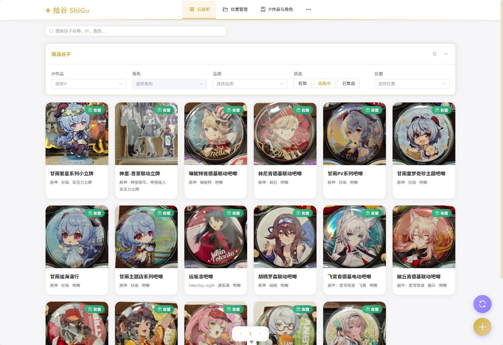
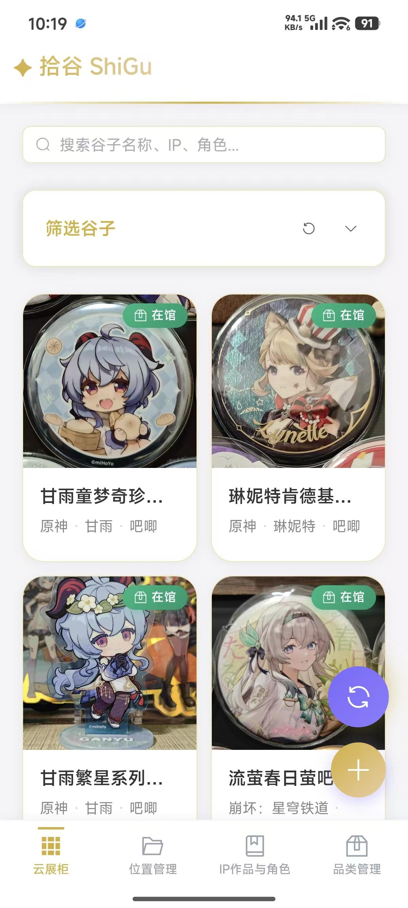

# 拾谷 PickGoods 前端

<div align="center">


**面向谷子/二次元收藏场景的数字化资产管理前端**

[快速开始](#快速开始) · [功能概览](#功能概览) · [开发文档](docs/DEVELOPMENT.md) · [API 文档](docs/API.md) · [部署说明](docs/DEPLOYMENT.md)

</div>

---

## 项目简介

拾谷 PickGoods 用于管理实体收藏品的数字档案：录入谷子信息、管理 IP/角色/品类/主题、维护收纳位置，并通过云展柜、谷仓检索和统计看板完成日常浏览与整理。

当前前端基于 Vue 3 + TypeScript + Vite，配套 Element Plus、Pinia、Vue Router、ECharts 与 Capacitor。后端接口以前缀 `/api` 的 REST API 为主，前端请求封装位于 `src/api/*` 与 `src/utils/request.ts`。

## 功能概览

| 模块 | 路由 | 说明 |
|------|------|------|
| 登录/注册 | `/login` | 登录、注册并获取 Token；受保护路由会自动跳转登录页 |
| 云展柜 | `/showcase` | 默认入口，包含「展柜」「谷仓」「统计看板」三个 Tab |
| 展柜 | `/showcase` | 我的展柜/公共展柜切换，支持私有展柜创建、编辑、删除、封面上传、添加/移除/排序谷子 |
| 谷仓 | `/showcase` | 搜索、筛选、分页、相似随机视图、详情抽屉、右键编辑/删除/排序 |
| 统计看板 | `/showcase` | 基于当前筛选统计资产概览、状态分布、官谷/同人分布、作品类型、IP/品类 TopN |
| 资产录入 | `/goods/new`、`/goods/:id/edit` | 新增/编辑谷子，支持多角色、主题、图片裁剪、主图和补充图片上传 |
| 草稿箱 | `/goods/drafts` | 查看并继续编辑状态为 `draft` 的谷子 |
| 位置管理 | `/location` | 树形收纳位置、位置详情、位置下谷子列表、位置 CRUD |
| IP 与角色 | `/ipcharacter` | IP/角色管理、关键词、角色头像、拖拽排序、Bangumi 导入 |
| 品类管理 | `/category` | 树形品类 CRUD、颜色标签、同级拖拽排序 |
| 主题管理 | `/theme` | 主题 CRUD、主题图片上传/标签/删除 |
| 设置 | `/settings` | 运行时后端地址配置、当前账号信息、退出登录、管理员入口 |
| 管理后台 | `/admin/*` | 管理员可进入用户管理、全站谷子管理以及公共元数据管理 |

详细说明见 [功能特性文档](docs/FEATURES.md)。

## 快速开始

### 环境要求

| 工具 | 要求 | 来源 |
|------|------|------|
| Node.js | `^20.19.0 || >=22.12.0` | `package.json#engines` |
| pnpm | `>=9.0.0`，项目声明 `pnpm@9.0.0` | `package.json#packageManager` |
| 浏览器 | 现代浏览器，支持 Vue 3/Vite 构建产物 | 项目运行环境 |

建议优先使用 pnpm，不要混用 npm/yarn/pnpm 安装依赖。仓库中同时存在 `package-lock.json` 与 `pnpm-lock.yaml`，但 `packageManager` 明确指定 pnpm。

### 安装与运行

```bash
pnpm install

# 可选：设置默认后端地址
# 新建 .env，并按需写入：
# VITE_API_BASE_URL=http://127.0.0.1:8000

pnpm dev
```

开发服务器默认访问地址为 Vite 输出的本地地址，通常是 `http://localhost:5173`。`vite.config.ts` 已将开发环境的 `/api` 代理到 `http://127.0.0.1:8000`。

### 后端地址优先级

前端每次请求前都会重新计算后端基础地址，优先级为：

1. 设置页写入的 `localStorage.pickgoods_api_base_url`
2. 兼容旧键 `localStorage.shigu_api_base_url`
3. 构建时环境变量 `VITE_API_BASE_URL`
4. 默认值 `当前页面协议://当前页面主机名:8000`

所有 API 封装中的路径都包含 `/api/...`，因此：

- 如果使用独立 API 域名，可设置 `VITE_API_BASE_URL=https://api.example.com`
- 如果用同源 Nginx 反代 `/api`，可设置 `VITE_API_BASE_URL=https://app.example.com`
- 移动端真机不能使用 `localhost` 指向电脑后端，应在设置页或构建环境中配置局域网/线上地址

## 开发命令

```bash
pnpm dev          # 启动 Vite 开发服务器
pnpm build        # 类型检查 + 生产构建
pnpm build-only   # 仅执行 vite build
pnpm preview      # 本地预览 dist
pnpm type-check   # vue-tsc 类型检查
pnpm lint         # ESLint 检查并自动修复
pnpm test:unit    # Vitest 单元测试
pnpm deploy       # 构建后执行 deploy.cjs 上传 dist
```

`pnpm deploy` 会读取 `deploy.cjs` 中的 SFTP 配置。该文件当前为本地部署脚本，请在使用前确认服务器、路径和凭据配置，并避免将真实密钥或密码提交到公开仓库。

## 项目结构

```text
PickGoods_Frontend/
├── docs/                       # 项目文档
├── patches/                    # patch-package 补丁
├── public/                     # Vite 静态资源
├── screenshot/                 # README/docs 引用的界面截图
├── src/
│   ├── api/                    # 后端接口封装与类型引用
│   ├── components/             # 通用组件、展柜组件、统计组件等
│   ├── router/                 # Vue Router 路由与鉴权守卫
│   ├── stores/                 # Pinia 状态管理
│   ├── styles/                 # 主题变量、全局样式、Element Plus 覆盖
│   ├── utils/                  # request 封装、树工具、MD5 工具
│   ├── views/                  # 页面级组件
│   │   ├── admin/              # 管理后台页面
│   │   └── goods-form/         # 谷子表单拆分模块
│   ├── workers/                # Web Worker
│   └── __tests__/              # Vitest 测试
├── capacitor.config.ts         # Capacitor 移动端配置
├── deploy.cjs                  # SFTP 部署脚本
├── package.json                # 脚本、依赖、Node/pnpm 要求
├── vite.config.ts              # Vite 配置和开发代理
└── vitest.config.ts            # 单元测试配置
```

## 技术栈

| 技术 | 版本 | 用途 |
|------|------|------|
| Vue | 3.5.26 | Composition API 前端框架 |
| TypeScript | 5.9.3 | 类型系统 |
| Vite | 7.3.0 | 开发服务器与构建 |
| Vue Router | 4.6.4 | 路由和导航守卫 |
| Pinia | 3.0.4 | 状态管理 |
| Element Plus | 2.8.8 | UI 组件 |
| Axios | 1.7.7 | HTTP 请求 |
| ECharts | 6.0.0 | 统计图表 |
| lodash-es | 4.17.21 | 防抖等工具函数 |
| sortablejs | 1.15.3 | 拖拽排序 |
| vue-picture-cropper | 0.7.0 | 图片裁剪 |
| Capacitor | 8.0.0 | Android 原生壳和移动端能力 |

## 界面截图

<div align="center">



*PC 端云展柜/谷仓界面*



*移动端云展柜/谷仓界面*

</div>

## 项目文档

| 文档 | 说明 |
|------|------|
| [功能特性](docs/FEATURES.md) | 页面、模块和主要交互说明 |
| [开发指南](docs/DEVELOPMENT.md) | 本地开发、约定、测试和角色协作 |
| [API 接口](docs/API.md) | 前端已封装 API、请求体、响应体和请求配置 |
| [部署说明](docs/DEPLOYMENT.md) | Web 静态部署、Nginx、运行时后端地址、SFTP 脚本 |
| [移动端开发](docs/MOBILE_DEVELOPMENT.md) | Capacitor Android 与可选 iOS 接入说明 |
| [设计规范](docs/STYLING.md) | 主题变量、样式结构、响应式和已知样式注意事项 |
| [常见问题](docs/TROUBLESHOOTING.md) | 开发、生产、移动端、认证和部署排障 |

## 后端仓库

- 后端实现：`ShiGu_backend`
- 仓库地址：`https://github.com/DICKQI/ShiGu_backend`

## 许可证

当前仓库未包含独立 `LICENSE` 文件，`package.json` 也未声明开源许可证。若需要公开分发或开源，请先补充明确的许可证文本。
